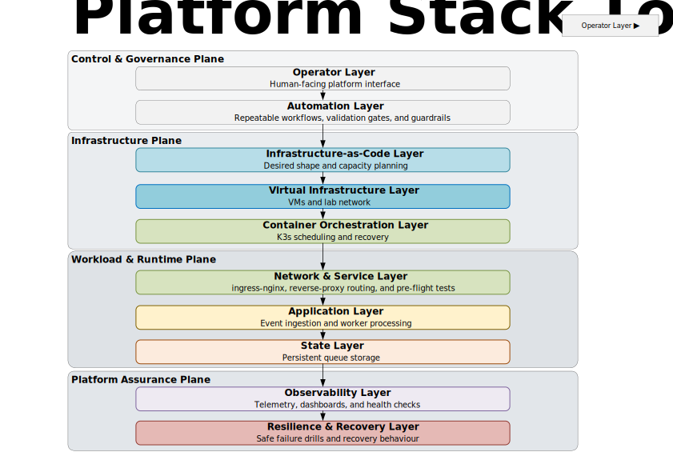
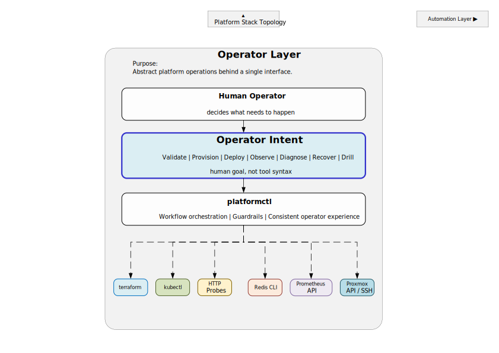
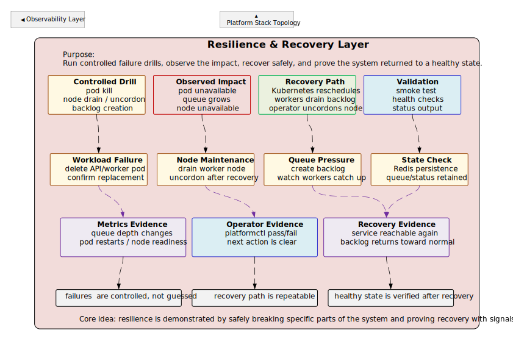

# Platform Engineering Lab

[](https://github.com/ashnassef/platform-engineering-lab/actions/workflows/ci.yml)

A self-directed infrastructure and platform engineering lab built to demonstrate how established hands-on infrastructure experience transfers into a software-driven platform environment using Terraform, Kubernetes, Go, Redis, Prometheus, and Grafana.

The lab runs on a local Proxmox host and focuses on engineering concerns that carry across infrastructure environments: defining capacity, controlling change, protecting state, observing behaviour, recovering from failure, and giving operators a repeatable interface.

> This is a deliberately small lab used to demonstrate engineering judgment and operational reasoning. It is not presented as production infrastructure, a highly available platform, or public-cloud experience.

## Why I Built This

My professional background is in hands-on infrastructure engineering across compute, storage, virtualization, networking, identity, backup, recovery, and research-computing systems.

I built this platform to bridge that experience into the type of software-defined infrastructure used by modern platform teams:

- infrastructure expressed and constrained through code;
- workloads managed through Kubernetes desired state;
- application and platform behaviour exposed through metrics;
- operational workflows consolidated into repeatable tooling;
- failure scenarios tested rather than assumed;
- limitations and production gaps documented explicitly.

The technologies changed, but the core engineering questions remained familiar.

## Platform Overview



The platform contains:

- one physical Proxmox host;
- three Ubuntu 24.04 virtual machines;
- one k3s control-plane node and two worker nodes;
- Terraform-defined VM topology and capacity guardrails;
- a Go API and Redis-backed worker system;
- ingress-nginx for application routing;
- Prometheus and Grafana for observability;
- Redis AOF persistence on a local-path Kubernetes PVC;
- `platformctl` as the primary operator interface.

The main request path is:

```text
Client
  → ingress-nginx
  → Go API
  → Redis queue and state
  → Go worker replicas
```

Prometheus scrapes API and worker metrics, while Grafana presents platform and workload behaviour.

## Operator Model



[`platformctl`](infra/proxmox-lab/platformctl) consolidates the lab's lifecycle and operational workflows behind one interface.

It supports:

- environment verification and capacity checks;
- Terraform-driven VM provisioning;
- k3s bootstrap and node validation;
- application deployment;
- status and smoke testing;
- worker scaling;
- diagnostics and repair workflows;
- dashboard access;
- controlled failure and recovery drills.

This reduces reliance on undocumented command sequences and makes preconditions, evidence, and outcomes more consistent.

Representative commands:

```bash
./platformctl verify
./platformctl capacity
./platformctl build
./platformctl deploy
./platformctl status
./platformctl smoke
./platformctl scale workers 3
./platformctl diagnose
```

Failure demonstrations are available through the `drill` command family.

## Operational Demonstrations



The lab has been exercised through scenarios including:

- API and worker pod deletion followed by Kubernetes recovery;
- Redis pod deletion and recovery;
- worker bottlenecks, queue growth, scaling, and backlog drain;
- readiness failure while Redis is unavailable;
- Redis persistence across pod replacement;
- safe node drain that avoids the node holding the local-path Redis PVC;
- idempotent API request replay;
- queue backpressure, retry, and dead-letter behaviour;
- Prometheus target and application-health verification.

The purpose of these exercises is not simply to show that Kubernetes restarts pods. Each workflow checks preconditions, triggers a controlled failure, observes the platform response, and verifies the resulting state.

## Engineering Decisions and Tradeoffs

Several choices were intentionally constrained to keep the lab small and explainable:

- **k3s on Proxmox** provides a realistic local environment without claiming public-cloud experience.
- **Terraform** defines VM topology and adds capacity guardrails.
- **Redis lists** provide a simple queue model suitable for demonstrating worker behaviour.
- **AOF and a PVC** preserve Redis state across pod replacement.
- **ingress-nginx** provides explicit edge routing into the cluster.
- **platformctl** centralizes operator intent and verification.
- **Local-path storage** is treated as node-bound, so the drain workflow avoids the Redis PVC node.

Known limitations are documented rather than hidden. These include one physical host, single-instance Redis, node-bound storage, possible stranded in-flight jobs after worker termination, and incomplete per-pod worker metrics after horizontal scaling.

See [Decisions and Limitations](docs/DECISIONS_AND_LIMITATIONS.md) for the full discussion and the changes that would be required in a production environment.

## Repository Layout

```text
.
├── app/                    Go API and worker services
├── k8s/                    Kubernetes manifests
├── observability/          Prometheus and Grafana configuration
├── infra/proxmox-lab/      Terraform, automation, and platformctl
├── docs/                   Architecture, operations, decisions, and runbooks
├── tools/                  Public-copy verification tooling
├── docker-compose.yml      Local application development path
├── Makefile
└── README.md
```

## Documentation

### Start Here

- [Architecture](docs/ARCHITECTURE.md)  
  Verified system components, dependencies, and execution flow.

- [Operations](docs/OPERATIONS.md)  
  Operator workflows, validation, scaling, diagnosis, and recovery drills.

- [Decisions and Limitations](docs/DECISIONS_AND_LIMITATIONS.md)  
  Design reasoning, deliberate constraints, known gaps, and production considerations.

### Additional Evidence

- [Final Demo Runbook](docs/FINAL_DEMO_RUNBOOK.md)
- [Production Readiness Assessment](docs/PRODUCTION_READINESS.md)
- [Security and Publication Process](docs/SECURITY_AND_PUBLICATION.md)
- [Complete Architecture Diagram Set](docs/diagrams/README.md)
- [Navigable Visio Source](docs/diagrams/source/platform_architecture_diagrams.vsdx)

The rendered SVG diagrams are intended for direct viewing on GitHub. The optional Visio source contains the complete navigable diagram set.

## Testing and CI

The Go unit tests cover small pure logic paths such as idempotency-key parsing and worker retry decisions, so they run without Redis or Kubernetes. CI runs on pushes to `main`, pull requests targeting `main`, and manual dispatches. Results are visible in GitHub Actions and on the badge above.

## Suggested Repository Tour

For a quick review:

1. Read this README.
2. View the three featured diagrams.
3. Review [`platformctl`](infra/proxmox-lab/platformctl).
4. Read [Decisions and Limitations](docs/DECISIONS_AND_LIMITATIONS.md).
5. Review the [Final Demo Runbook](docs/FINAL_DEMO_RUNBOOK.md).

For a deeper technical review:

1. Follow the execution flow in [Architecture](docs/ARCHITECTURE.md).
2. Inspect the Terraform configuration under `infra/proxmox-lab/`.
3. Inspect the Kubernetes manifests under `k8s/`.
4. Review the Go API and worker under `app/`.
5. Compare the operational drills with the documented recovery evidence.

## Validation

The publication copy is checked with:

```bash
bash -n
go test ./...
go build -buildvcs=false ./...
terraform fmt -check -recursive infra/proxmox-lab
jq
tools/verify-public-copy.sh
```

The publication process also verifies the allowlisted file manifest and rejects prohibited state, credentials, authentication material, image archives, logs, caches, and Git metadata.

Terraform validation requires provider availability and is therefore separate from the offline publication-copy checks.

## Scope

This repository demonstrates:

- infrastructure design and automation;
- Kubernetes platform operations;
- application-aware observability;
- stateful workload reasoning;
- failure and recovery testing;
- operator tooling and guardrails;
- explicit design tradeoffs.

It does not claim:

- production Kubernetes experience at an employer;
- public-cloud deployment;
- Redis high availability;
- multi-host failure domains;
- production-scale distributed systems;
- production-scale operation.
