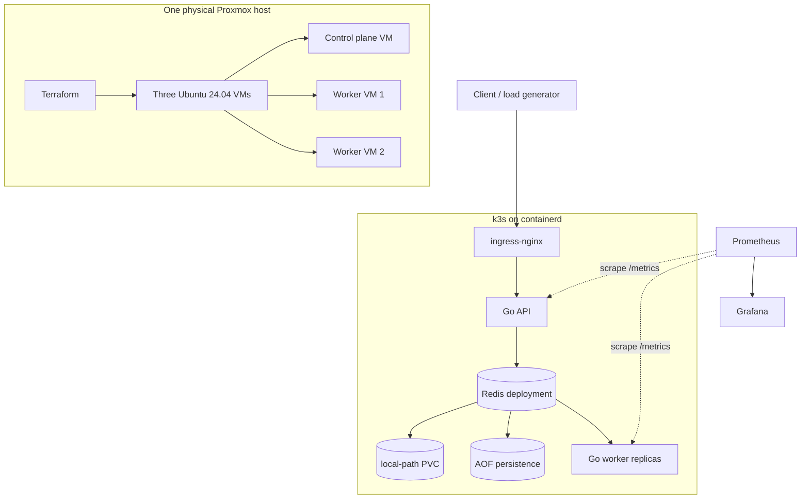

# Architecture

This document describes the verified implementation only.

## Verified Stack

- One physical Proxmox host
- Three Ubuntu 24.04 VMs
- Terraform-defined VM topology and capacity guardrails
- k3s and containerd
- ingress-nginx
- Go API service
- Redis queue and state store
- Go worker replicas
- Prometheus
- Grafana
- `platformctl` as the primary operator interface
- Redis local-path PVC and AOF persistence

## System Flow

## Implementation Notes

- The control-plane VM runs the Kubernetes API, schedulers, and cluster services.
- Two worker VMs run the application, Redis, ingress, Prometheus, and Grafana workloads as scheduled by k3s.
- Redis is deployed as a single instance with a `ReadWriteOnce` local-path PVC and AOF enabled.
- The API and worker services expose Prometheus metrics that are scraped by the in-cluster Prometheus instance.
- `platformctl` orchestrates Terraform, VM bring-up, Kubernetes checks, deployments, scaling, drills, repair, and inspection.

## Repository Map

- `app/`: Go API, worker, and shared event type
- `k8s/`: manifests for API, worker, Redis, ingress, and monitoring
- `observability/`: Prometheus and Grafana provisioning
- `infra/proxmox-lab/`: Terraform plus operator automation
- `docs/`: design, operations, publication, and runbook notes
